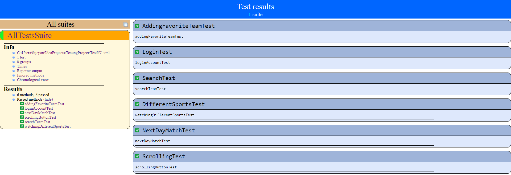

# Testiranje [Rezultati.com](https://www.rezultati.com/)

Testiranje je napravio Stjepan Kekelić u svrhu projekta za kolegij Metode i tehnike testiranja programske podrške. 

Testiranje je napravljeno u razvojnom okruženju [IntelliJ IDEA](https://www.jetbrains.com/idea/download/#section=windows) 
kojeg je potrebno skinuti ako se žele izvršiti napravljeni testovi.

###Upute za potrebne alate:

* potrebno je skinuti [JAVA JDK](https://www.oracle.com/java/technologies/downloads/) i instalirati ako to već nije napravljeno
  1. otvoriti cmd
  2. upisati java -verision
  3. ako je prikazana neka od verzija, nije potrebno instalirati JAVA JDK
* treba provjeriti verziju Chrome  preglednika i instalirati odgovarajući [ChromeDriver](https://chromedriver.chromium.org/downloads)
  1. otvoriti Chrome preglednik
  2. pronaći "Settings"
  3. otvoriti zadnju opciju "About Chrome"
  4. pročitati verziju Chroma, koja je potrebna za skidanje odgovarajućeg Chromedriver-a
  5. skinuti [ChromeDriver](https://chromedriver.chromium.org/downloads) u ovisnosti o verziji Chroma, ako je verzija Chroma 97. 
  onda skinuti taj ChromeDriver
  6. napraviti novu mapu "webdrivers" unutar C diska (potrebno je napraviti isto ako se ne želi mijenjati putanja do ChromeDrivera)
  7. ako je ChromeDriver skinut, prebaciti ga u kreiranu mapu
  8. kopirati putanju do chromedriver.exe i dodati je kao novu varijablu okoline
  (*"Advance system setting" -> "Environment Variables" -> odabrati "Path" -> "Edit" -> "New" -> zalijepiti kopiranu putanju*)

###Testiranje unutar IntelliJ razvojnog okruženja

Za Testiranje je napravljen novi Maven projekt.

Unutar kreiranje pom.xml potrebno je navesti ovisnosti("dependecies") koji se koriste u projektu, gotovi kod za ovisnosti
moguće je pronaći na [https://mvnrepository.com/](https://mvnrepository.com/)
* selenium-java verzija 3.141.59
* testng verzija 6.14.3
* maven-surefire-report-plugin verzija 2.22.1
* maven-compiler-plugin verzija 3.8.1

**Testni slučajevi:**
1. **DifferentSportsTest** - Testna klasa  koja služi za testiranje ispravnosti otvaranja određenih sportova (Tenis, Rukomet)
te dodatnih sportova (Zimski sportovi).
2. **LoginTest** - Testna klasa napravljena s ciljem testiranja prijave registriranog korisnika. Ako prijava uspije korisnički
email bi trebao biti vidljiv na početnoj stranici.
   * Koristi usluge klase **LoginForm** koja je napravljena s ciljem da olakša prijave u drugim testnim slučajevima ako im bude
   bila potrebna prijava te da olakša moguće izmjene.
3. **ScrollingTest** - Testna klasa koja testira ispravnost ScrollingToTopButton komponente unutar web aplikacije. Test koristi
JavascriptExecutor kako bi pomaknuo stranicu web aplikacije na dno, gdje se mora pojaviti navedeni gumb te pritiskom na 
njega web aplikacija treba prikazati vrh web stranice.
4. **SearchTest** - Testna klasa koja služi za ispitivanje ispravnosti pretraživanja timova i sportova. Navedena klasa upisuje
nazive timova te unutar dobivene liste odgovarajući timovi moraju biti prikazani prvi.
5. **AddingFavoriteTeamTest** - Testna klasa koja dodaje određeni tim pod favoritom, te se isti taj tim treba prikazati unutar
liste mojih timova.
6. **NextDayMatchTest** - Testna klasa koja služi za ispitivanje otvaranja prve utakmice idućeg dana. Pomoću kalendara web 
aplikacije odabire se idući dan te u listi utakmica odabire se prva te se otvara novi web prozor. (Aplikacija radi s 
velikom količinom podataka, tako da je svaki dan sigurno jedna utakmica)
* Osim navedenog neke testne klase koriste implicitno ili eksplicitno čekanje pojedinih komponenti da se prikažu u web 
aplikaciji, kako ne bi došlo do neželjenog pada testa.

**Rezultati testiranja:**

Pomoću datoteke *TestNG.xml*  moguće je pokrenuti sve testove koji su navedeni u toj klasi. Navedena datoteka služi i za
pokretanje testiranja preko terminala unosom *mvn test* i pritisnuti ctrl+enter. Nakon toga moguće je vidjeti rezultate 
testiranje unutar datoteke *target -> surfire-reports -> index.htmp* te ako ju otvorimo pomoću web preglednika dobivamo 
testne rezultate kao na slici:

